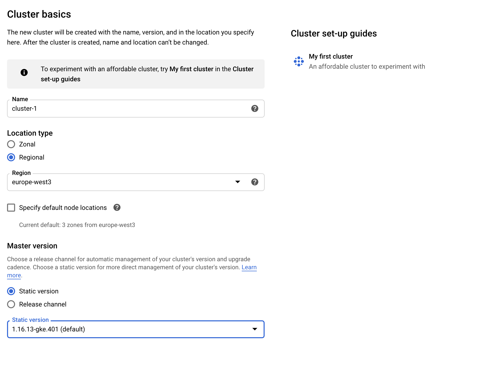
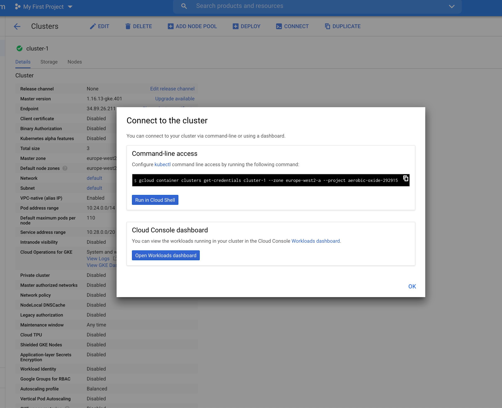

## Setup Kubernetes cluster

- Create cluster in Google Cloud Platform webinterface


- Install [Google Cloud SDK](https://cloud.google.com/sdk/docs/install) (`glcoud` command)

- Initialize gcloud (`gcloud init`) 

- In the web interface, select cluster and then click "Connect" at the top


- Run the displayed command in your local shell

- Connect to the new Kubernetes context

  `kubectl config use-context gke_aerobic-oxide-292915_europe-west2-a_cluster-1`


# Install Argo CD

See https://argoproj.github.io/argo-cd/getting_started/

- Run following commands to install Argo CD

  ```
  kubectl create namespace argocd
  kubectl apply -n argocd -f https://raw.githubusercontent.com/argoproj/argo-cd/stable/manifests/install.yaml
  kubectl create clusterrolebinding cluster-admin-binding --clusterrole=cluster-admin --user="$(gcloud config get-value account)"
  ```
  
- The initial password is autogenerated to be the pod name of the Argo CD API server. This can be retrieved with the command:

  ```
  kubectl get pods -n argocd -l app.kubernetes.io/name=argocd-server -o name | cut -d'/' -f 2
  ```
  
 - Use port forward to access Argo CD web interface

  ```
  kubectl port-forward svc/argocd-server -n argocd 8080:443
  ```

- Go to localhost and login with user admin and pod name from above

- Create root application in Argo CD web interface

```
apiVersion: argoproj.io/v1alpha1
kind: Application
metadata:
  name: root
spec:
  destination:
    name: ''
    namespace: argocd
    server: 'https://kubernetes.default.svc'
  source:
    path: k8s/apps
    repoURL: 'https://github.com/mkue/enduro'
    targetRevision: HEAD
    directory:
      recurse: true
  project: default
  syncPolicy:
    automated:
      prune: false
      selfHeal: false
```
